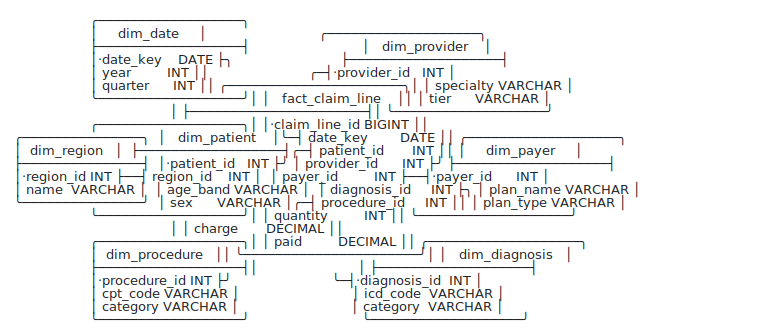

# dbsketch

ASCII-art ERD diagrams from DBML or SQL, designed to look clean by default and live happily inside a README, a docstring, or an LLM prompt.

A claims warehouse, compiled from raw SQL with no `FOREIGN KEY`s declared — all relationships inferred from PK-name matches:

<picture>
  <source media="(prefers-color-scheme: dark)" srcset="docs/hero-dark.svg">
  
</picture>

<details><summary>Copy as text</summary>

```
                   ╭──────────────────╮
                   │     dim_date     │                            ╭───────────────────╮
                   ├──────────────────┤                            │   dim_provider    │
                   │·date_key    DATE ├╮                           ├───────────────────┤
                   │ year         INT ││                         ╭─┤·provider_id   INT │
                   │ quarter      INT ││ ╭──────────────────────╮│ │ specialty VARCHAR │
                   ╰──────────────────╯│ │   fact_claim_line    ││ │ tier      VARCHAR │
                                       │ ├──────────────────────┤│ ╰───────────────────╯
                   ╭──────────────────╮│ │·claim_line_id BIGINT ││
╭───────────────╮  │   dim_patient    │╰─┤ date_key        DATE ││ ╭───────────────────╮
│  dim_region   │  ├──────────────────┤╭─┤ patient_id       INT ││ │     dim_payer     │
├───────────────┤  │·patient_id   INT ├╯ │ provider_id      INT ├╯ ├───────────────────┤
│·region_id INT ├──┤ region_id    INT │  │ payer_id         INT ├──┤·payer_id      INT │
│ name  VARCHAR │  │ age_band VARCHAR │  │ diagnosis_id     INT ├╮ │ plan_name VARCHAR │
╰───────────────╯  │ sex      VARCHAR │╭─┤ procedure_id     INT ││ │ plan_type VARCHAR │
                   ╰──────────────────╯│ │ quantity         INT ││ ╰───────────────────╯
                                       │ │ charge       DECIMAL ││
                   ╭──────────────────╮│ │ paid         DECIMAL ││ ╭───────────────────╮
                   │  dim_procedure   ││ ╰──────────────────────╯│ │   dim_diagnosis   │
                   ├──────────────────┤│                         │ ├───────────────────┤
                   │·procedure_id INT ├╯                         ╰─┤·diagnosis_id  INT │
                   │ cpt_code VARCHAR │                            │ icd_code  VARCHAR │
                   │ category VARCHAR │                            │ category  VARCHAR │
                   ╰──────────────────╯                            ╰───────────────────╯
```

</details>

> The diagram above is an SVG; everything below is real monospace text and assumes **`line-height: 1`**. Terminals and editors do that by default; markdown viewers vary. See [Viewing](#viewing) if a diagram renders with gaps.

## Why this exists

Existing ERD tools — Mermaid, dbdiagram, GraphViz — lay out in continuous 2D space and project onto a grid. The projection is where things break: variable-width entities don't snap cleanly, edges meet boxes off-center, dense schemas need manual repositioning to be readable. Most of them produce SVG/PNG output that you can't paste into a README, a CHANGELOG entry, or a prompt.

dbsketch designs for the integer character grid from cell zero. Output is the algorithm's native form — no projection step, no approximation gap, no manual tweaking for the 90% case. When the algorithm picks something ugly, a one-line hint fixes that one thing.

## Quick start

```sh
npm install -g @dbsketch/cli
```

Given a DBML file:

```dbml
Table users {
  id int [pk]
  email varchar
}
Table posts {
  id int [pk]
  user_id int [ref: > users.id]
  title varchar
}
Table comments {
  id int [pk]
  post_id int [ref: > posts.id]
  user_id int [ref: > users.id]
  body varchar
}
```

```sh
dbsketch blog.dbml
```

```
                   ╭───────────────╮  ╭──────────────╮
╭───────────────╮  │     posts     │  │   comments   │
│     users     │  ├───────────────┤  ├──────────────┤
├───────────────┤  │·id        int ├╮ │·id       int │
│·id        int ├┬─┤ user_id   int │╰─┤ post_id  int │
│ email varchar ││ │ title varchar │╭─┤ user_id  int │
╰───────────────╯│ ╰───────────────╯│ │ body varchar │
                 │                  │ ╰──────────────╯
                 ╰──────────────────╯
```

SQL works too:

```sh
dbsketch schema.sql
dbsketch --sql --dialect=mysql < schema.sql
```

Library API:

```ts
import { compile, compileSql } from '@dbsketch/core';

const ascii = compile(dbmlSource);
const ascii = compileSql(sqlSource, 'postgres');
```

## What it's for

- **README and docs.** Diagrams that live in version-controlled text, render in any markdown viewer, and produce meaningful diffs.
- **LLM prompts.** ASCII ERDs are dense, accurate context for code-generation agents. SVG image diagrams aren't.
- **Code review.** A schema change becomes a readable diff in the diagram, not a blob change in a binary.
- **Terminal-first workflows.** No browser, no image viewer, no copy-from-design-tool round-trip.

## Philosophy: no fuss

dbsketch is opinionated about three things and indifferent about the rest:

1. **Deterministic.** Same input, byte-identical output. Diffs are meaningful, snapshot tests are reliable, CI pipelines are stable.
2. **Clean by default.** The algorithm produces something readable on every schema we've thrown at it (real and synthetic), with no flags or hints. When it doesn't, one hint fixes it.
3. **Code-first.** No GUIs, no themes, no color, no drag-to-reposition. The schema is the source of truth; the diagram is a derived view.

If you want to manually route an edge or change a font, this isn't the tool.

## Examples

### Star schema (auto-centered hub)

For a fact table with many dimensions, dbsketch detects the hub and places it in the center:

```
╭───────────────╮
│   store_dim   │
├───────────────┤
│·id        int ├─╮                      ╭──────────────╮
│ name  varchar │ │                      │   date_dim   │
╰───────────────╯ │╭──────────────────╮  ├──────────────┤
                  ││    sales_fact    │╭─┤·id       int │
╭───────────────╮ │├──────────────────┤│ │ date    date │
│ customer_dim  │ ││·id           int ││ ╰──────────────╯
├───────────────┤ ││ date_id      int ├╯
│·id        int ├╮││ product_id   int ├╮ ╭──────────────╮
│ email varchar ││╰┤ store_id     int ││ │ product_dim  │
╰───────────────╯╰─┤ customer_id  int ││ ├──────────────┤
                   │ promotion_id int │╰─┤·id       int │
╭───────────────╮╭─┤ channel_id   int │  │ sku  varchar │
│  channel_dim  ││ │ currency_id  int ├╮ ╰──────────────╯
├───────────────┤│╭┤ employee_id  int ││
│·id        int ├╯││ quantity     int ││ ╭──────────────╮
│ name  varchar │ ││ unit_price   int ││ │ currency_dim │
╰───────────────╯ ││ total        int ││ ├──────────────┤
                  │╰──────────────────╯╰─┤·id       int │
╭───────────────╮ │                      │ code varchar │
│ employee_dim  │ │                      ╰──────────────╯
├───────────────┤ │
│·id        int ├─╯
│ name  varchar │
╰───────────────╯
```

`·` marks primary key columns. Tees on the entity border (`├`, `┤`) mark relationship endpoints.

### Clinical OLTP (transactional schema with a clear hub)

An EHR-style schema centered on the `encounter` table — the visit that ties patient, provider, diagnoses, medications, and vitals together. The hub is detected automatically; sibling tables order themselves by where they attach on `encounter` so related rows sit close to their FK columns.

```dbml
Table patient   { id int [pk] mrn varchar name varchar dob date }
Table provider  { id int [pk] npi varchar name varchar specialty varchar }
Table encounter {
  id int [pk]
  patient_id int [ref: > patient.id]
  provider_id int [ref: > provider.id]
  encounter_type varchar
  started_at timestamp
  ended_at timestamp
}
Table diagnosis  { id int [pk] encounter_id int [ref: > encounter.id] icd_code varchar description varchar }
Table medication { id int [pk] encounter_id int [ref: > encounter.id] prescriber_id int [ref: > provider.id] name varchar dose varchar }
Table vital      { id int [pk] encounter_id int [ref: > encounter.id] measure varchar value decimal recorded_at timestamp }
```

```
╭───────────────────────╮
│       diagnosis       │
├───────────────────────┤
│·id                int │
│ encounter_id      int ├╮                              ╭───────────────────╮
│ icd_code      varchar ││                              │    medication     │
│ description   varchar ││                              ├───────────────────┤
╰───────────────────────╯│                              │·id            int │
                         │ ╭────────────────────────╮╭──┤ encounter_id  int │
╭───────────────────────╮│ │       encounter        ││╭─┤ prescriber_id int │
│         vital         ││ ├────────────────────────┤││ │ name      varchar │
├───────────────────────┤├─┤·id                 int ├╯│ │ dose      varchar │
│·id                int ││╭┤ patient_id         int │ │ ╰───────────────────╯
│ encounter_id      int ├╯││ provider_id        int ├─│╮
│ measure       varchar │ ││ encounter_type varchar │ ││╭───────────────────╮
│ value         decimal │ ││ started_at   timestamp │ │││     provider      │
│ recorded_at timestamp │ ││ ended_at     timestamp │ ││├───────────────────┤
╰───────────────────────╯ │╰────────────────────────╯ ╰┴┤·id            int │
                          │                             │ npi       varchar │
╭───────────────────────╮ │                             │ name      varchar │
│        patient        │ │                             │ specialty varchar │
├───────────────────────┤ │                             ╰───────────────────╯
│·id                int ├─╯
│ mrn           varchar │
│ name          varchar │
│ dob              date │
╰───────────────────────╯
```

Notice `provider` sits opposite `medication`, not stacked under `patient`: port-aware ordering placed it to align with `encounter.provider_id` (and `medication.prescriber_id`, also on the right), keeping those edges short.

## How it works (brief)

The canvas is a **strip grid** — alternating node strips (where entities sit) and channel strips (where edges route). Coordinates are integer cells from start to finish; nothing is laid out in continuous space and projected.

- **Layout.** Auto-detected hub (highest-degree entity) goes in the center, with neighbors fanning out left and right by FK distance. Entities pack tightly per column.
- **Sibling ordering.** Within a column, entities order by barycenter — the mean row position of their FK neighbors — so connected entities cluster together. For star schemas where every dim shares the same fact-table neighbor (and would all tie on raw barycenter), a port-aware tiebreaker sorts each dim by which row of the fact it attaches to. Result: dim_date sits next to fact.date_id, dim_currency sits next to fact.currency_id, edges are short and rarely cross.
- **Column ordering.** Each entity's columns are searched: declared order vs PK-FK-other. The full layout runs for each candidate, and whichever yields fewer edge crossings (tie-break: shorter total V length) wins. Entities the rule wouldn't change (already conventional) are skipped. Opt out per-entity or globally with `@layout { preserve_order ... }`.
- **Routing.** Each edge decomposes into horizontal and vertical segments. Segments within a channel pack onto tracks via interval scheduling (greedy, O(n log n)). Multi-hop edges route through a shared top margin above all entities. Edges that share a parent port collapse into a single trunk that branches. Self-FKs and edges between same-column entities route around the adjacent channel rather than silently dropping.
- **Rendering.** Each cell holds one glyph. Bend cells use direction-set merging so corners upgrade to tees naturally and horizontal-meets-vertical produces the conventional "h passes under v" gap.

The pipeline runs in low milliseconds for schemas of dozens of tables, including the few extra layout passes the column-ordering search adds for hub-like entities. A 100-entity star schema compiles in under 4ms.

By restricting ourselves to monospace UTF-8 box-drawing characters, the algorithm sidesteps every continuous-space problem: there's no font-metric ambiguity, no kerning, no anti-aliasing, no DPI. Cells align because they're cells. There's no aesthetic knob to fuss with because the medium doesn't offer one.

## When defaults don't fit

Five opt-in behaviors, all simple. Most schemas need none of them.

### `--no-types` (compact name-only mode)

Useful when types are noise — high-level structural overviews where you care about who-references-what, narrow rendering contexts, or dense schemas where every saved character matters. The savings compound: each entity gets narrower, and a narrower entity means narrower channels around it.

A real 12-entity schema (instrument design for a survey platform), with types — about 200 characters wide:

```
                                                                                 ╭───────────────────────────────────────────────────────────╮
                                                                                 │                                                           │
                                                      ╭─────────────────────────╮│                                                           │
                           ╭───────────────────────╮  │    scoring_rule_item    ││                                                           │
                           │    response_option    │  ├─────────────────────────┤│                                                           │
                           ├───────────────────────┤  │ scoring_rule_id integer ├╯                                                           │
                           │·option_id     integer │  │ qq_id           integer ├╮                                                           │
                           │ question_id   integer ├╮ │ weight             real ││                                                           │
                         ╭─┤ option_set_id integer ││ │ reverse_score   boolean ││                               ╭──────────────────────────╮│
                         │ │ option_text      text ││ ╰─────────────────────────╯│                               │      questionnaire       ││
                         │ │ option_value     text ││                            │                               ├──────────────────────────┤│
                         │ │ concept_id    integer ││ ╭─────────────────────────╮│ ╭──────────────────────────╮╭─┤·questionnaire_id integer ├│┬╮
                         │ ╰───────────────────────╯│ │        skip_rule        ││ │  questionnaire_question  ││ │ study_id         integer ││││
                         │                          │ ├─────────────────────────┤│ ├──────────────────────────┤│ │ name                text ││││╭──────────────────────────╮  ╭─────────────────────────╮
╭───────────────────────╮│ ╭───────────────────────╮│ │·skip_rule_id    integer │├─┤·qq_id            integer ││ │ version             text │││││       scoring_rule       │  │    scoring_category     │
│  response_option_set  ││ │      grid_column      ││ │ qq_id           integer ├╯ │ questionnaire_id integer ├╯ │ canonical_url       text ││││├──────────────────────────┤  ├─────────────────────────┤
├───────────────────────┤│ ├───────────────────────┤│ │ trigger_qq_id   integer │╭─┤ question_id      integer │  ╰──────────────────────────╯╰││┤·scoring_rule_id  integer ├╮ │·category_id     integer │
│·option_set_id integer ├╯ │·column_id     integer ││ │ operator           text ││ │ section_id       integer ├╮                              │╰┤ questionnaire_id integer │╰─┤ scoring_rule_id integer │
│ name             text │  │ question_id   integer ├┤ │ trigger_value      text ││ │ parent_qq_id     integer ││ ╭──────────────────────────╮ │ │ name                text │  │ label              text │
│ canonical_url    text │  │ column_text      text ││ │ action             text ││ │ count_qq_id      integer ││ │         section          │ │ │ formula             text │  │ min_score          real │
╰───────────────────────╯  │ column_value     text ││ │ enable_behavior    text ││ │ display_order    integer ││ ├──────────────────────────┤ │ ╰──────────────────────────╯  │ max_score          real │
                           ╰───────────────────────╯│ ╰─────────────────────────╯│ │ required         boolean │╰─┤·section_id       integer │ │                               ╰─────────────────────────╯
                                                    │                            │ ╰──────────────────────────╯  │ questionnaire_id integer ├─╯
                           ╭───────────────────────╮│ ╭─────────────────────────╮│                               │ name                text │
                           │       grid_row        ││ │        question         ││                               │ display_order    integer │
                           ├───────────────────────┤│ ├─────────────────────────┤│                               ╰──────────────────────────╯
                           │·row_id        integer │├─┤·question_id     integer ├╯
                           │ question_id   integer ├╯ │ link_id            text │
                           │ row_text         text │  │ question_type      text │
                           │ display_order integer │  │ question_text      text │
                           ╰───────────────────────╯  │ concept_id      integer │
                                                      │ version            text │
                                                      ╰─────────────────────────╯
```

Same schema with `--no-types` — about 165 characters wide (17% narrower), and the relationship structure is what your eye lands on first:

```
                                                                   ╭─────────────────────────────────────────────────╮
                                                                   │                                                 │
                                              ╭───────────────────╮│                                                 │
                         ╭─────────────────╮  │ scoring_rule_item ││                                                 │
                         │ response_option │  ├───────────────────┤│                                                 │
                         ├─────────────────┤  │ scoring_rule_id   ├╯                                                 │
                         │·option_id       │  │ qq_id             ├╮                                                 │
                         │ question_id     ├╮ │ weight            ││                                                 │
                       ╭─┤ option_set_id   ││ │ reverse_score     ││                             ╭──────────────────╮│
                       │ │ option_text     ││ ╰───────────────────╯│                             │  questionnaire   ││
                       │ │ option_value    ││                      │                             ├──────────────────┤│
                       │ │ concept_id      ││ ╭───────────────────╮│ ╭────────────────────────╮╭─┤·questionnaire_id ├│┬╮
                       │ ╰─────────────────╯│ │     skip_rule     ││ │ questionnaire_question ││ │ study_id         ││││
                       │                    │ ├───────────────────┤│ ├────────────────────────┤│ │ name             ││││╭──────────────────╮  ╭──────────────────╮
╭─────────────────────╮│ ╭─────────────────╮│ │·skip_rule_id      │├─┤·qq_id                  ││ │ version          │││││   scoring_rule   │  │ scoring_category │
│ response_option_set ││ │   grid_column   ││ │ qq_id             ├╯ │ questionnaire_id       ├╯ │ canonical_url    ││││├──────────────────┤  ├──────────────────┤
├─────────────────────┤│ ├─────────────────┤│ │ trigger_qq_id     │╭─┤ question_id            │  ╰──────────────────╯╰││┤·scoring_rule_id  ├╮ │·category_id      │
│·option_set_id       ├╯ │·column_id       ││ │ operator          ││ │ section_id             ├╮                      │╰┤ questionnaire_id │╰─┤ scoring_rule_id  │
│ name                │  │ question_id     ├┤ │ trigger_value     ││ │ parent_qq_id           ││ ╭──────────────────╮ │ │ name             │  │ label            │
│ canonical_url       │  │ column_text     ││ │ action            ││ │ count_qq_id            ││ │     section      │ │ │ formula          │  │ min_score        │
╰─────────────────────╯  │ column_value    ││ │ enable_behavior   ││ │ display_order          ││ ├──────────────────┤ │ ╰──────────────────╯  │ max_score        │
                         ╰─────────────────╯│ ╰───────────────────╯│ │ required               │╰─┤·section_id       │ │                       ╰──────────────────╯
                                            │                      │ ╰────────────────────────╯  │ questionnaire_id ├─╯
                         ╭─────────────────╮│ ╭───────────────────╮│                             │ name             │
                         │    grid_row     ││ │     question      ││                             │ display_order    │
                         ├─────────────────┤│ ├───────────────────┤│                             ╰──────────────────╯
                         │·row_id          │├─┤·question_id       ├╯
                         │ question_id     ├╯ │ link_id           │
                         │ row_text        │  │ question_type     │
                         │ display_order   │  │ question_text     │
                         ╰─────────────────╯  │ concept_id        │
                                              │ version           │
                                              ╰───────────────────╯
```

### `--no-columns` (whole-schema overview)

Collapse every entity to a 3-row name-only box. Edges still route correctly — every FK to/from an entity converges on a single port per side. Use this for high-level "what tables exist and how are they connected" overviews of large schemas, where column-level detail would make the diagram unreadable. Combines well with [clustering](docs/large-schemas.md). For OMOP-scale schemas (~40 tables, ~180 refs), this is often the only way to fit the whole-schema view on a page.

### `--no-infer-refs` (skip relationship inference)

When a SQL schema declares no `FOREIGN KEY`s (common in warehouses), dbsketch infers relationships from PK-name matches: a non-PK column named `respondent_id` in one table that matches a PK column named `respondent_id` in another becomes a one-to-many ref. Pass `--no-infer-refs` to skip this and render only declared relationships.

### `--ascii` (7-bit ASCII glyphs)

Falls back to `+`, `-`, `|` and `*` for environments where Unicode box-drawing doesn't render cleanly.

### `--sql` and `--dialect=NAME`

SQL DDL input. Dialect defaults to `postgres` (which also reads SQLite cleanly). Other supported dialects: `mysql`, `mssql`, `snowflake`.

### `@layout` hints (DBML extension)

Pin an entity to a specific column or row:

```dbml
@layout {
  pin users at col 0, row 0
}
```

Override the auto-detected hub or bias which entities sit on which side:

```dbml
@layout {
  center sales_fact { left: date_dim, customer_dim right: store_dim, product_dim }
}
```

Opt out of automatic column ordering — by default, dbsketch tries reordering columns within each entity (PK → FK → other) and keeps whichever produces fewer routing crossings. To freeze declared column order:

```dbml
@layout {
  preserve_order             // every entity
  // preserve_order users, posts   // or only specific entities
}
```

Split a large schema into focused sub-diagrams. Each cluster renders as its own diagram with a header; cross-cluster FKs become `↳ target.col (Cluster)` annotation rows on the source column. See [docs/large-schemas.md](docs/large-schemas.md) for a full walkthrough.

```dbml
@layout {
  cluster "Clinical Events" { person, visit_occurrence, condition_occurrence }
  cluster "Vocabularies"   { concept, vocabulary, domain }
}
```

These hints are local to one pipeline stage each. They don't cascade and don't surprise.

## CLI reference

```
Usage: dbsketch [options] [file.dbml|file.sql]

Reads DBML or SQL DDL from a file (or stdin if omitted) and writes
the rendered ERD to stdout. SQL inputs are detected by the .sql
extension; for stdin, use --sql to force SQL mode.

Options:
  --ascii            Use 7-bit ASCII glyphs (+, -, |) instead of Unicode
  --sql              Treat input as SQL DDL (forced for stdin)
  --dialect=NAME     SQL dialect: postgres (default), mysql, mssql, snowflake
  --no-infer-refs    Don't infer relationships from PK-name matches when
                     the schema declares none (default: infer)
  --no-types         Render column names only, no data types. Entities are
                     correspondingly narrower
  --no-columns       Collapse entities to 3-row name-only boxes (no columns
                     shown). For whole-schema overviews of large schemas
  -h, --help         Show this help
```

## Library API

```ts
import { compile, compileSql } from '@dbsketch/core';

compile(dbmlSource, options?)
compileSql(sqlSource, dialect?, options?)

// Options:
// {
//   glyphs?:      'unicode' | 'ascii'   // default 'unicode'
//   inferRefs?:   'auto' | 'never'      // default 'auto'
//   showTypes?:   boolean               // default true
//   showColumns?: boolean               // default true; false → name-only boxes
// }
```

The lower-level packages (`@dbsketch/parser`, `@dbsketch/layout`, `@dbsketch/render`) are also published if you want to walk the IR or layout directly.

## Worked example: narrowing a wide diagram with a hint

The snowflake schema from the top of this README, as DBML:

```dbml
Table dim_date     { date_key date [pk] year integer month integer }
Table dim_country  { country_id integer [pk] name varchar }
Table dim_region   { region_id integer [pk] name varchar country_id integer [ref: > dim_country.country_id] }
Table dim_store    { store_id integer [pk] name varchar region_id integer [ref: > dim_region.region_id] }
Table dim_product  { product_id integer [pk] sku varchar name varchar }
Table fact_sales {
  sale_id bigint [pk]
  date_key date [ref: > dim_date.date_key]
  store_id integer [ref: > dim_store.store_id]
  product_id integer [ref: > dim_product.product_id]
  quantity integer
  revenue decimal
}
```

Default rendering puts `fact_sales` in the center with dim subtrees fanning out left and right — five columns wide:

```
                                                ╭───────────────────╮
                                                │     dim_date      │
                                                ├───────────────────┤  ╭────────────────────╮
                                                │·date_key     date ├╮ │     fact_sales     │
╭────────────────────╮  ╭────────────────────╮  │ year      integer ││ ├────────────────────┤  ╭────────────────────╮
│    dim_country     │  │     dim_region     │  │ month     integer ││ │·sale_id     bigint │  │    dim_product     │
├────────────────────┤  ├────────────────────┤  ╰───────────────────╯╰─┤ date_key      date │  ├────────────────────┤
│·country_id integer ├╮ │·region_id  integer ├╮                      ╭─┤ store_id   integer │╭─┤·product_id integer │
│ name       varchar │╰─┤ country_id integer ││ ╭───────────────────╮│ │ product_id integer ├╯ │ sku        varchar │
╰────────────────────╯  │ name       varchar ││ │     dim_store     ││ │ quantity   integer │  │ name       varchar │
                        ╰────────────────────╯│ ├───────────────────┤│ │ revenue    decimal │  ╰────────────────────╯
                                              │ │·store_id  integer ├╯ ╰────────────────────╯
                                              ╰─┤ region_id integer │
                                                │ name      varchar │
                                                ╰───────────────────╯
```

To narrow it to four columns, wrap `dim_product` below `dim_date` by pinning it. Append this to the DBML:

```dbml
@layout {
  pin dim_product at col 2, row 2
}
```

```
                                                ╭────────────────────╮
                                                │      dim_date      │
                                                ├────────────────────┤
                                                │·date_key      date ├╮
                                                │ year       integer ││
                                                │ month      integer ││
                                                ╰────────────────────╯│ ╭────────────────────╮
                                                                      │ │     fact_sales     │
╭────────────────────╮  ╭────────────────────╮  ╭────────────────────╮│ ├────────────────────┤
│    dim_country     │  │     dim_region     │  │     dim_store      ││ │·sale_id     bigint │
├────────────────────┤  ├────────────────────┤  ├────────────────────┤╰─┤ date_key      date │
│·country_id integer ├╮ │·region_id  integer ├╮ │·store_id   integer ├──┤ store_id   integer │
│ name       varchar │╰─┤ country_id integer │╰─┤ region_id  integer │╭─┤ product_id integer │
╰────────────────────╯  │ name       varchar │  │ name       varchar ││ │ quantity   integer │
                        ╰────────────────────╯  ╰────────────────────╯│ │ revenue    decimal │
                                                                      │ ╰────────────────────╯
                                                ╭────────────────────╮│
                                                │    dim_product     ││
                                                ├────────────────────┤│
                                                │·product_id integer ├╯
                                                │ sku        varchar │
                                                │ name       varchar │
                                                ╰────────────────────╯
```

Same schema, same algorithm — one hint to encode local intent.

### Biasing which dimensions land on which side

For a fact-table-style schema, dbsketch auto-centers the highest-degree entity and splits its neighbors alphabetically between left and right. If you'd rather group them yourself, the `@center` hint takes optional `left:` and `right:` lists.

```dbml
Table fact_orders {
  order_id int [pk]
  date_key int [ref: > dim_date.date_key]
  customer_id int [ref: > dim_customer.customer_id]
  product_id int [ref: > dim_product.product_id]
  store_id int [ref: > dim_store.store_id]
  amount decimal
}
Table dim_date     { date_key int [pk] year int month int }
Table dim_customer { customer_id int [pk] email varchar segment varchar }
Table dim_product  { product_id int [pk] sku varchar name varchar }
Table dim_store    { store_id int [pk] name varchar region varchar }
```

Default centering (alphabetical split — `dim_customer` and `dim_product` end up on the left):

```
╭─────────────────╮                       ╭────────────────╮
│  dim_customer   │                       │    dim_date    │
├─────────────────┤  ╭─────────────────╮  ├────────────────┤
│·customer_id int ├╮ │   fact_orders   │╭─┤·date_key   int │
│ email   varchar ││ ├─────────────────┤│ │ year       int │
│ segment varchar ││ │·order_id    int ││ │ month      int │
╰─────────────────╯│ │ date_key    int ├╯ ╰────────────────╯
                   ╰─┤ customer_id int │
╭─────────────────╮╭─┤ product_id  int │  ╭────────────────╮
│   dim_product   ││ │ store_id    int ├╮ │   dim_store    │
├─────────────────┤│ │ amount  decimal ││ ├────────────────┤
│·product_id  int ├╯ ╰─────────────────╯╰─┤·store_id   int │
│ sku     varchar │                       │ name   varchar │
│ name    varchar │                       │ region varchar │
╰─────────────────╯                       ╰────────────────╯
```

With an explicit grouping — "who" dimensions on the left, "what/where" on the right:

```dbml
@layout {
  center fact_orders { left: dim_date, dim_customer right: dim_product, dim_store }
}
```

```
╭─────────────────╮                       ╭────────────────╮
│    dim_date     │                       │  dim_product   │
├─────────────────┤  ╭─────────────────╮  ├────────────────┤
│·date_key    int ├╮ │   fact_orders   │╭─┤·product_id int │
│ year        int ││ ├─────────────────┤│ │ sku    varchar │
│ month       int ││ │·order_id    int ││ │ name   varchar │
╰─────────────────╯╰─┤ date_key    int ││ ╰────────────────╯
                   ╭─┤ customer_id int ││
╭─────────────────╮│ │ product_id  int ├╯ ╭────────────────╮
│  dim_customer   ││ │ store_id    int ├╮ │   dim_store    │
├─────────────────┤│ │ amount  decimal ││ ├────────────────┤
│·customer_id int ├╯ ╰─────────────────╯╰─┤·store_id   int │
│ email   varchar │                       │ name   varchar │
│ segment varchar │                       │ region varchar │
╰─────────────────╯                       ╰────────────────╯
```

`@center` also overrides the auto-detected hub if you want a different entity in the middle.

## Viewing

Text diagrams assume **`line-height: 1`** — the vertical box-drawing character (`│`) is sized to touch between rows, so any extra leading produces visible gaps. Terminals, editors, and code blocks render with line-height 1 by default; prose-mode markdown sometimes doesn't (notably GitHub's README renderer, which is why the example above is an SVG). For the cleanest experience, view a diagram in your terminal: `dbsketch schema.dbml`.

In docs sites where you control the CSS, one line fixes it. With MkDocs + Material (which enables `pymdownx.superfences` by default), tag your diagram fences:

````markdown
```{.dbsketch}
╭───╮
│ … │
╰───╯
```
````

…then in your extra CSS:

```css
.dbsketch { line-height: 1; }
```

Regular code blocks keep their comfortable spacing.

## License

MIT.
